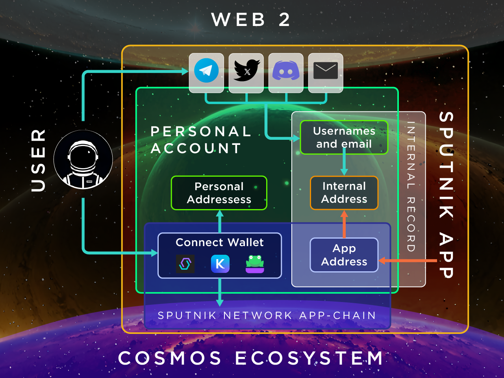

# Glossary of terms and Scheme

<figure><figcaption></figcaption></figure>

* [**User**](user.md)
* [**Web2**](web2.md)
* [**Web3**](web3.md)
* [**Crypto-wallet**](crypto-wallet.md)
* [**Cosmos Ecosystem**](cosmos-ecosystem.md)
* [**Sputnik App**](sputnik-app.md)
* [**Sputnik Network App-chain**](sputnik-network-app-chain.md)
* [**Personal Account**](personal-account.md)
* [**App Address**](app-address.md)
* [**Internal Address**](internal-address.md)
* [**Internal Record**](internal-record.md)
* [**Personal Address**](personal-address.md)
* [**Personal Sputnik-Address**](personal-sputnik-address.md)
