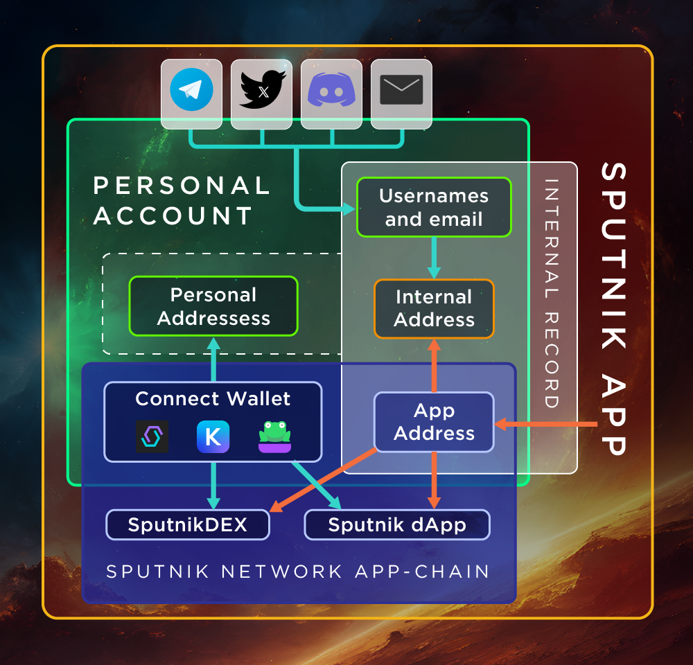

# Personal Account

<figure><figcaption></figcaption></figure>

Through the **Personal Account**, the [**User**](../glossary-of-terms-and-scheme/user.md) interacts with [**Sputnik App**](./):&#x20;

* The **Personal Account** displays [**Web2**](web2-functionality/) and [**Web3**](web3-functionality/) connections to the [**User**](../glossary-of-terms-and-scheme/user.md)&#x20;
* Each [**Personal Account**](personal-account.md) has its own [**Internal Address**](../glossary-of-terms-and-scheme/internal-address.md), which [**Sputnik App**](./) uses to provide the user with [**Web2 functionality**](web2-functionality/)&#x20;
* Using an [**Internal Address**](../glossary-of-terms-and-scheme/internal-address.md) is optional&#x20;
* In the **Personal Account**, the user can use [**Web2 (centralized)**](web2-functionality/) and [**Web3 (decentralized)**](web3-functionality/) functionality
