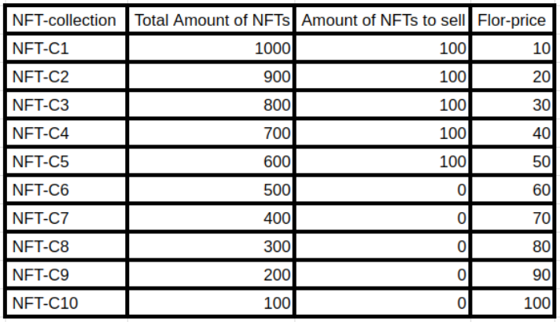

# Distribution model of StreamDrop for NFT-holders

**!!! This is the not final version !!!**

**!!! All parameters and criteria can be changed at any time, and moreover, will definitely be changed during the testnet !!!**

**!!! The final version of the distribution will be approved after the testnet and before the mainnet launch !!!**

Once the full list of NFT collections is approved, the following calculations will be made:&#x20;

1. Calculation of the number of NFTs in the collection suitable for StreamDrop: \
   "**Total number of existing NFTs**" - "**Amount of NFTs on sale**" = "**Amount of NFTs to drop**"&#x20;
2. Calculation of the capitalization of each NFT collection: \
   "**Number of NFTs to drop**" \* "**NFT floor price**" = **Collection Capitalization**&#x20;
3. Calculation of the total capitalization of all NFT collections: \
   Sum of all **Collection Capitalizations** = **Total Capitalization**&#x20;

**Total Capitalization** will be equal to **10,000,000** $**SIGNAL**&#x20;

4. After this, we will be able to find out the % of each **Collection Capitalization** from the **Total Capitalization**, and it will become known what **%-distribution** of **10,000,000** $**SIGNAL** will be allocated to each of the NFT collections:\
   "**%-distribution**" / "**Number NFT for drop**" = **Amount of $SIGNAL for StreamDrop** for each NFT in the collection&#x20;
5. Adjustment of StreamDrop distribution taking into account that some NFTs will receive a x2 multiplier&#x20;

## Example of $SIGNAL distribution across NFT collections:&#x20;

_Let's say we have 10 NFT collections:_

<figure><figcaption></figcaption></figure>

* NFT-C1 - 1000 NFTs of which 100 are on sale, floor price $10&#x20;
* NFT-C2 - 900 NFTs of which 100 are on sale, floor price $20&#x20;
* NFT-C3 - 800 NFTs of which 100 are on sale, floor price $30&#x20;
* NFT-C4 - 700 NFTs of which 100 are on sale, floor price $40&#x20;
* NFT-C5 - 600 NFTs of which 100 are on sale, floor price $50&#x20;
* NFT-C6 - 500 NFTs of which 0 are on sale, floor price $60&#x20;
* NFT-C7 - 400 NFTs of which 0 are on sale, floor price $70&#x20;
* NFT-C8 - 300 NFTs of which 0 are on sale, floor price $80&#x20;
* NFT-C9 - 200 NFTs of which 0 are on sale, floor price $90&#x20;
* NFT-C10 - 100 NFTs of which 0 are on sale, floor price $100

Based on the data in the example:&#x20;

**Total Capitalization = 205,000$ = 10,000,000 $SIGNAL**

<figure><figcaption></figcaption></figure>

## Example of $SIGNAL distribution correction across NFT collections:&#x20;

_Let's say NFT-C10 consists of 100 NFTs, 50 of which should receive a x2 multiplier:_

<figure><figcaption></figcaption></figure>

**!!! These are all examples !!! Real numbers will differ !!!**
